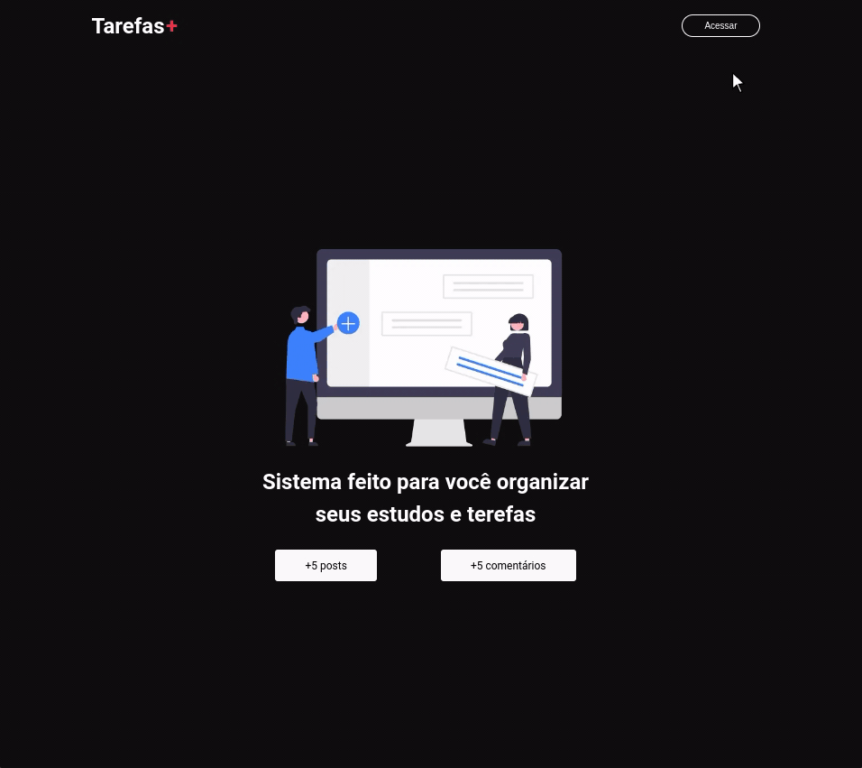

# Task Manager

O projeto `Task Manager` é um aplicativo web que oferece recursos de gerenciamento de tarefas em um painel de controle. Com ele, os usuários podem registrar, visualizar e gerenciar suas tarefas de forma organizada. O aplicativo utiliza o framework Next.js e o Firebase como banco de dados em tempo real.

## Funcionalidades

- Adicionar novas tarefas através de um formulário.
- Visualizar uma lista das tarefas existentes.
- Compartilhar as tarefas através da cópia da URL correspondente.
- Excluir tarefas.
- Visualizar detalhes de uma tarefa específica.
- Adicionar comentários às tarefas.
- Excluir comentários próprios.

## Deploy

O projeto está atualmente implantado na Vercel e pode ser acessado através do seguinte link:

[https://favorito-repos.vercel.app](https://task-manager-ebon-xi.vercel.app/)

## Tecnologias Utilizadas

- ⚡️🌐 Framework [Next.js](https://nextjs.org/docs)
- 🔥💾 [Firebase](https://firebase.google.com/docs?hl=pt-br) (Banco de dados em tempo real)
- 🧩⚛️ [Componentes React](https://react.dev/learn/importing-and-exporting-components)
- 🎨💻 [Estilização com CSS](https://devdocs.io/css/)
- ⚛️🎨 [React Icons](https://react-icons.github.io/react-icons/)
- 🔒🔑 Autenticação e gerenciamento de usuários com [NextAuth.js](https://next-auth.js.org/getting-started/introduction)

## Recursos Aprendidos

Durante o desenvolvimento deste projeto, foram adquiridos conhecimentos em várias áreas, incluindo:

  

  ⚡️🌐 Framework Next.js
  
 

  O uso do framework Next.js no desenvolvimento deste projeto trouxe uma série de benefícios. Com o Next.js, pude criar um aplicativo web altamente otimizado e de alto desempenho. A renderização do lado do servidor (SSR) proporcionou uma experiência de carregamento mais rápida, melhorando a usabilidade do aplicativo. Além disso, o Next.js facilitou a implementação de rotas e o gerenciamento do estado global, tornando o desenvolvimento mais eficiente e escalável.

  

    🔥💾 Firebase
  
 

  A integração do Firebase como banco de dados em tempo real foi essencial para o funcionamento do aplicativo. Com o Firebase, pude armazenar e sincronizar os dados das tarefas em tempo real, garantindo que as informações estivessem sempre atualizadas para todos os usuários. 

  
🎨💻 Estilização com CSS
 

  A estilização com CSS foi aplicada para criar uma aparência agradável e consistente no aplicativo. Utilizando as melhores práticas de estilização, pude criar estilos personalizados para cada componente e página, garantindo uma experiência visualmente atraente. Além disso, a estilização com CSS permitiu a aplicação de animações e transições suaves, melhorando a usabilidade e a experiência do usuário.

  

    🔒🔑 Autenticação e gerenciamento de usuários com NextAuth.js
  
 

 A implementação da autenticação e do gerenciamento de usuários no aplicativo foi feita utilizando o NextAuth.js. Essa biblioteca facilitou a integração com o provedor de autenticação Google, permitindo que os usuários façam login no aplicativo utilizando suas contas Google.

